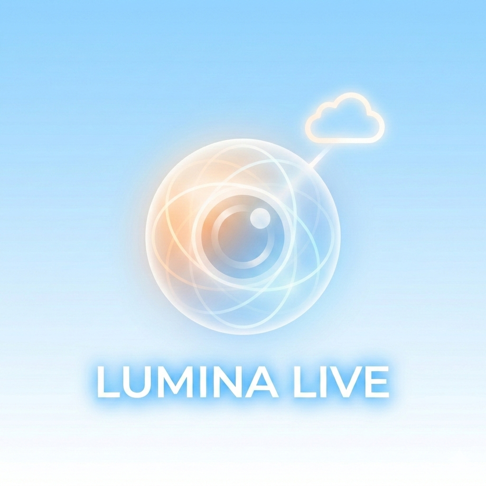

# Lumina Live

<p align="center">
  
</p>

<p align="center">
  <strong>A Gemini-powered agent that sees guests, orchestrates the UI via voice, and syncs visual IDs with staff for a seamless, cloud-hosted human-to-digital experience.</strong>
</p>

---

## 🌟 Overview

**Lumina Live** is an AI-powered kiosk system featuring **Kim**, a multimodal conversational agent built on Google's **Gemini 2.0 Flash Live API**. Kim uses real-time vision and voice to assist customers with ordering, while synchronizing visual identification with staff for seamless order delivery.

### Key Features

- 🎤 **Voice-First Interaction** — Natural conversation with real-time audio streaming
- 👁️ **Vision Understanding** — Kim sees customers and remembers their appearance for order delivery
- 🖥️ **Agent-Controlled UI** — Gemini orchestrates the frontend via function calling
- 🔄 **Real-Time Sync** — Kitchen staff see orders with customer visual descriptions
- ☁️ **Cloud-Native** — Fully deployable on Google Cloud Run + Firebase

---

## 🏗️ Architecture

```
┌─────────────────────────────────────────────────────────────────┐
│                         LUMINA LIVE                              │
├─────────────────────────────────────────────────────────────────┤
│                                                                  │
│  ┌──────────────┐    WebSocket     ┌──────────────────────────┐ │
│  │   Frontend   │◄───────────────►│        Backend           │ │
│  │  (Next.js)   │                  │       (FastAPI)          │ │
│  │              │                  │                          │ │
│  │ • Camera     │                  │ • Session Manager        │ │
│  │ • Mic/Audio  │                  │ • Tool Handler           │ │
│  │ • UI Screens │                  │ • Firestore Client       │ │
│  │ • Kim Avatar │                  │                          │ │
│  └──────────────┘                  └───────────┬──────────────┘ │
│                                                │                 │
│                                    ┌───────────▼──────────────┐ │
│                                    │   Gemini Live API        │ │
│                                    │   (Multimodal Stream)    │ │
│                                    │                          │ │
│                                    │ • Audio In/Out           │ │
│                                    │ • Video Frames           │ │
│                                    │ • Function Calling       │ │
│                                    └──────────────────────────┘ │
│                                                                  │
│  ┌──────────────┐                  ┌──────────────────────────┐ │
│  │   Kitchen    │◄────────────────│        Firestore         │ │
│  │   Display    │     (Real-time)  │                          │ │
│  │              │                  │ • Orders Collection      │ │
│  │ • Order Queue│                  │ • Sessions Collection    │ │
│  │ • Customer ID│                  │                          │ │
│  └──────────────┘                  └──────────────────────────┘ │
│                                                                  │
└─────────────────────────────────────────────────────────────────┘
```

---

## 🎯 Customer Journey

```
┌─────────┐    ┌─────────┐    ┌─────────┐    ┌─────────┐    ┌─────────┐
│  IDLE   │───►│ GREETING│───►│ BROWSING│───►│ ORDERING│───►│ PAYMENT │
│         │    │         │    │         │    │         │    │         │
│ Kim     │    │ Kim     │    │ Kim     │    │ Kim     │    │ QR Code │
│ waves   │    │ greets  │    │ guides  │    │ confirms│    │ shown   │
│         │    │ customer│    │ menu    │    │ cart    │    │         │
└─────────┘    └─────────┘    └─────────┘    └─────────┘    └─────────┘
                                                                  │
                                                                  ▼
                                                           ┌─────────┐
                                                           │ KITCHEN │
                                                           │ DISPLAY │
                                                           │         │
                                                           │ Order + │
                                                           │ Visual  │
                                                           │ ID sent │
                                                           └─────────┘
```

---

## 🛠️ Tech Stack

| Layer | Technology |
|-------|------------|
| **AI Model** | Gemini 2.0 Flash Live (`gemini-2.0-flash-live-001`) |
| **Frontend** | Next.js 14, Tailwind CSS, Framer Motion, Zustand |
| **Backend** | FastAPI, WebSockets, google-genai SDK |
| **Database** | Firebase Firestore |
| **Deployment** | Google Cloud Run |
| **Audio** | 16-bit PCM @ 16kHz |
| **Video** | 768×768 JPEG frames @ 1fps |

---

## 📁 Project Structure

```
lumina-live/
├── frontend/                 # Next.js application
│   ├── app/                  # App router pages
│   ├── components/           # React components
│   │   ├── Kim/              # Agent avatar & states
│   │   ├── Menu/             # Menu grid & details
│   │   ├── Cart/             # Shopping cart
│   │   ├── Payment/          # QR payment flow
│   │   └── Camera/           # Video capture
│   ├── hooks/                # Custom hooks (audio, camera, websocket)
│   ├── stores/               # Zustand state management
│   └── lib/                  # Types, utils, mock data
│
├── backend/                  # FastAPI server
│   ├── main.py               # WebSocket endpoint
│   ├── gemini_client.py      # Gemini Live API integration
│   ├── session_manager.py    # Session & cart state
│   ├── firestore_client.py   # Database operations
│   ├── tools.py              # Gemini function definitions
│   ├── prompts.py            # Kim's system prompt
│   ├── menu_data.py          # Menu items
│   └── config.py             # Environment settings
│
├── docs/                     # Documentation
│   ├── setup-firebase.md     # Firebase setup guide
│   └── deploy-gcloud.md      # Cloud Run deployment
│
└── assets/                   # Project assets
    └── LuminaLive.png        # Logo
```

---

## 🚀 Quick Start

### Prerequisites

- Node.js 18+
- Python 3.11+
- Google Cloud account with Gemini API access
- Firebase project

### 1. Clone & Setup

```bash
git clone <repository-url>
cd lumina-live
```

### 2. Backend Setup

```bash
cd backend
python -m venv venv
source venv/bin/activate  # Windows: venv\Scripts\activate
pip install -r requirements.txt

# Configure environment
cp .env.example .env
# Edit .env with your API keys
```

### 3. Frontend Setup

```bash
cd frontend
yarn install
```

### 4. Run Development

```bash
# Terminal 1: Backend
cd backend
uvicorn main:app --reload --port 8000

# Terminal 2: Frontend
cd frontend
yarn dev
```

Visit `http://localhost:3000` to see Lumina Live in action!

---

## 🔧 Environment Variables

### Backend (.env)

```env
GOOGLE_API_KEY=your-gemini-api-key
GOOGLE_CLOUD_PROJECT=your-firebase-project-id
GOOGLE_APPLICATION_CREDENTIALS=./service-account.json
```

See [docs/setup-firebase.md](docs/setup-firebase.md) for detailed Firebase setup.

---

## 🤖 Kim's Capabilities

Kim can control the UI through these tools:

| Tool | Description |
|------|-------------|
| `navigate_screen` | Switch between home, category, cart, payment screens |
| `highlight_item` | Visually highlight a menu item |
| `select_item` | Open item detail modal |
| `add_to_cart` | Add item with quantity and customization |
| `remove_from_cart` | Remove item from cart |
| `set_customer_info` | Store name, appearance, table location |
| `show_payment` | Display QR code for payment |
| `submit_to_kitchen` | Send order to kitchen display |

---

## 📖 Documentation

- [Firebase Setup Guide](docs/setup-firebase.md)
- [Cloud Run Deployment](docs/deploy-gcloud.md)

---

## 🏆 Hackathon

Built for the **Gemini Live Agent Challenge** on Devpost.

**Challenge Focus**: Showcasing the Gemini 2.0 Flash Multimodal Live API for real-time, bidirectional voice and vision interactions.

---

## 📄 License

MIT License - See [LICENSE](LICENSE) for details.

---

<p align="center">
  Made with 💜 for the Gemini Live Agent Challenge
</p>
| `highlight_item` | `string \| null` | Highlight menu item |
| `select_item` | `string` | Open item detail |
| `close_detail` | - | Close item detail |
| `kim_speak` | `string` | Kim speaks message |
| `kim_state` | `'idle' \| 'active' \| 'speaking' \| 'listening'` | Update Kim state |
| `show_payment` | `number` | Show payment QR |

### Tech Stack

- Next.js 14 (App Router)
- Tailwind CSS
- Framer Motion
- Zustand
- Lucide Icons
