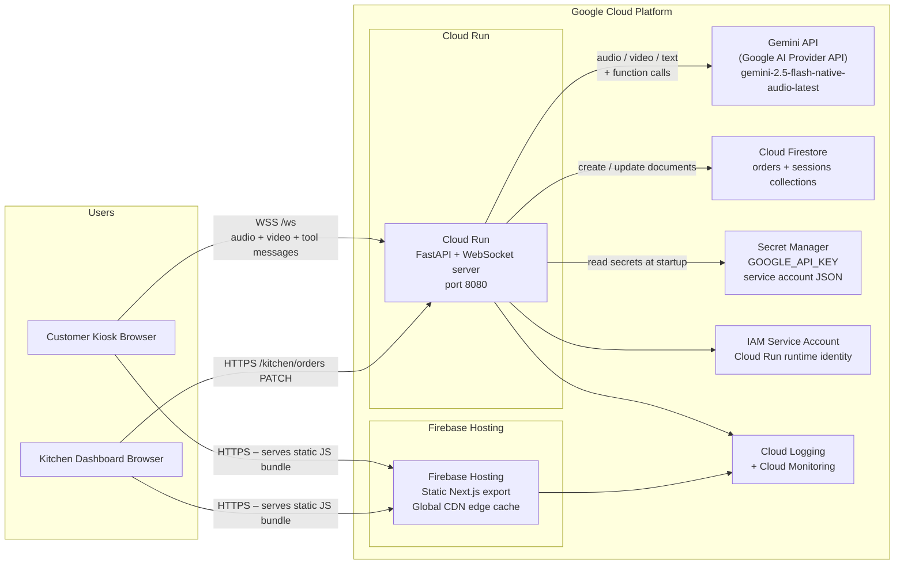

# GCP Ecosystem Diagram

This diagram reflects the production architecture of this project on Google Cloud Platform.

| Layer | GCP Product |
|---|---|
| Frontend Hosting | Firebase Hosting (static Next.js export, global CDN) |
| Backend Runtime | Cloud Run (FastAPI + WebSocket) |
| AI Provider | Gemini API (gemini-2.5-flash-native-audio-latest) |
| Database | Cloud Firestore (orders + sessions) |
| Secrets | Secret Manager |
| Identity | IAM Service Account |
| Observability | Cloud Logging + Cloud Monitoring |

